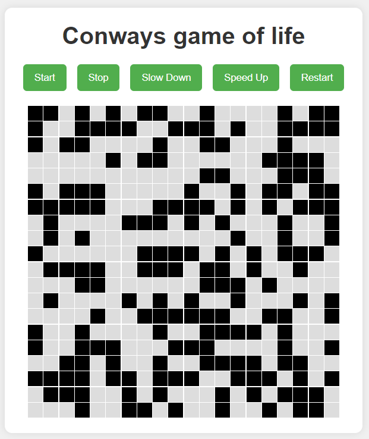

# Conways-Game-of-life

Conway's Game of Life is a classic cellular automaton devised by the mathematician John Horton Conway in 1970. It is a zero-player game, meaning that its evolution is determined by its initial state, requiring no further input. Despite its simplicity, the Game of Life exhibits complex and unpredictable behavior.

This repository contains an implementation of Conway's Game of Life written in javascript. The game is played on a two-dimensional grid of cells, each of which can be in one of two states: alive or dead. The game follows four simple rules:

1. Underpopulation: Any live cell with fewer than two live neighbors dies, as if by underpopulation.
2. Survival: Any live cell with two or three live neighbors lives on to the next generation.
3. Overpopulation: Any live cell with more than three live neighbors dies, as if by overpopulation.
4. Reproduction: Any dead cell with exactly three live neighbors becomes a live cell, as if by reproduction.

The game progresses in discrete steps, called generations. Each generation is determined by applying the above rules simultaneously to every cell in the current generation.

